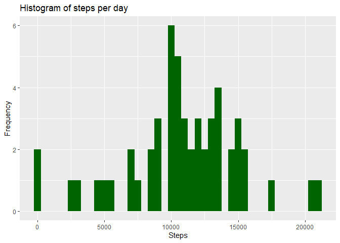
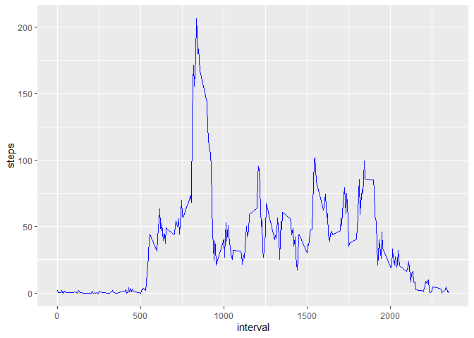
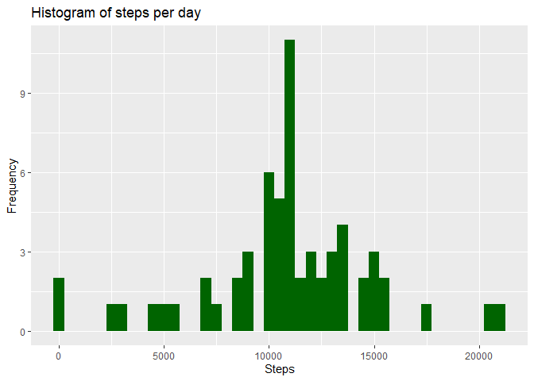
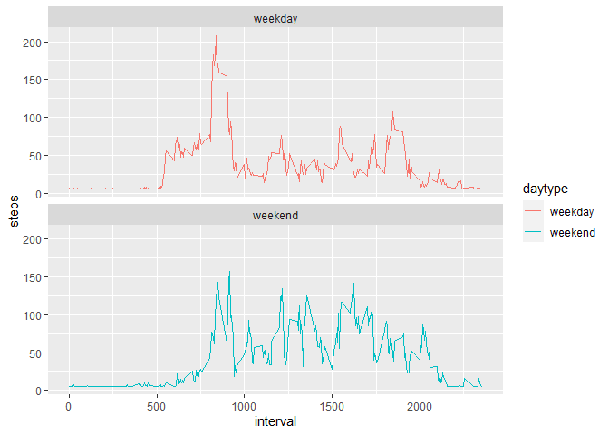

## Introduction

#### Background
It is now possible to collect a large amount of data about personal movement using activity monitoring
devices such as a Fitbit, Nike Fuelband, or Jawbone Up. These type of devices are part of the
"quantified self" movement -- a group of enthusiasts who take measurements about themselves regularly
to improve their health, to find patterns in their behavior, or because they are tech geeks. But these
data remain under-utilized both because the raw data are hard to obtain and there is a lack of statistical
methods and software for processing and interpreting the data.

#### Data
This assignment makes use of data from a personal activity monitoring device. This device collects data
at 5 minute intervals through out the day. The data consists of two months of data from an anonymous
individual collected during the months of October and November, 2012 and include the number of steps taken
in 5 minute intervals each day.

The dataset is stored in a csv-file, includes 17,568 observations and can be downloaded from here:

https://d396qusza40orc.cloudfront.net/repdata%2Fdata%2Factivity.zip

The variables of the dataset are:

Date: The date on which the measurement was taken in YYYY-MM-DD format </br>
Interval: The 5-minute interval in which measurement was taken (time of the day) </br>
Steps: Number of steps occured in the respective 5-minute interval </br>


## Loading and preprocessing the data


```r
library(tidyverse)
```

```
## Warning: package 'tidyverse' was built under R version 4.0.5
```

```
## -- Attaching packages --------------------------------------- tidyverse 1.3.1 --
```

```
## v ggplot2 3.3.3     v purrr   0.3.4
## v tibble  3.1.2     v dplyr   1.0.6
## v tidyr   1.1.3     v stringr 1.4.0
## v readr   1.4.0     v forcats 0.5.1
```

```
## Warning: package 'ggplot2' was built under R version 4.1.0
```

```
## Warning: package 'tibble' was built under R version 4.1.0
```

```
## Warning: package 'tidyr' was built under R version 4.1.0
```

```
## Warning: package 'readr' was built under R version 4.1.0
```

```
## Warning: package 'purrr' was built under R version 4.1.0
```

```
## Warning: package 'dplyr' was built under R version 4.1.0
```

```
## Warning: package 'stringr' was built under R version 4.1.0
```

```
## Warning: package 'forcats' was built under R version 4.1.0
```

```
## -- Conflicts ------------------------------------------ tidyverse_conflicts() --
## x dplyr::filter() masks stats::filter()
## x dplyr::lag()    masks stats::lag()
```

```r
library(lubridate)
```

```
## Warning: package 'lubridate' was built under R version 4.1.0
```

```
## 
## Attaching package: 'lubridate'
```

```
## The following objects are masked from 'package:base':
## 
##     date, intersect, setdiff, union
```

```r
activity_data <- read.csv('activity.csv')
activity_data$date <- ymd(activity_data$date)
```
The data is loaded into a dataframe (activity_data).

## What is mean total number of steps taken per day?


```r
steps_data <- activity_data %>%
  group_by(date) %>%
  summarize(spd = sum(steps)) %>%
  drop_na()

ggplot(steps_data, aes(x = spd)) +
    geom_histogram(fill = "darkgreen", binwidth = 500) +
    labs(title = "Histogram of steps per day", x = "Steps", y = "Frequency")
```

<!-- -->

```r
mean_spd <- mean(steps_data$spd)
median_spd <- median(steps_data$spd)
```
An analysis of the whole dataset leds to the following central measures regarding the number of
total steps taken a day: <br>
Mean: 10766.19 <br>
Median: 10765 <br>


## What is the average daily activity pattern?


```r
avg_act_pattern <- activity_data %>%
  filter(!is.na(steps)) %>%
  group_by(interval) %>%
  summarize(steps = mean(steps))

ggplot(avg_act_pattern, aes(x=interval, y=steps)) +
  geom_line(color = "blue")
```

<!-- -->

```r
max_intervall <- avg_act_pattern[which.max(avg_act_pattern$steps),]
```


## Imputing missing values
#### Background
Note that there are a number of days/intervals where there are missing values (coded as NA). The
presence of missing days may introduce bias into some calculations or summaries of the data.


1. Calculate and report the total number of missing values in the dataset
(i.e. the total number of rows with NAs)

2. Devise a strategy for filling in all of the missing values in the dataset. The strategy does not
need to be sophisticated. For example, you could use the mean/median for that day, or the mean for
that 5-minute interval, etc.

3. Create a new dataset that is equal to the original dataset but with the missing data filled in.

4. Make a histogram of the total number of steps taken each day and Calculate and report the mean and
median total number of steps taken per day. Do these values differ from the estimates from the first part of the assignment? What is the impact of imputing missing data on the estimates of the total daily number of steps?


```r
no_of_missing <- sum(is.na(activity_data$steps))
clean_data <- activity_data %>%
  mutate(steps=replace(steps, is.na(steps), mean(avg_act_pattern$steps)))
```
#### Anwsers
1. The no. of missing values in the dataset is 2304.<br>

2. Every step-entry with NA is replced with the mean-value of the whole set

3. Cleaned dataset is created.


```r
clean_data <- activity_data %>%
  mutate(steps=replace(steps, is.na(steps), mean(avg_act_pattern$steps)))
```
4. New histogram:

```r
steps_clean_data <- clean_data %>%
  group_by(date) %>%
  summarize(spd = sum(steps))

ggplot(steps_clean_data, aes(x = spd)) +
    geom_histogram(fill = "darkgreen", binwidth = 500) +
    labs(title = "Histogram of steps per day", x = "Steps", y = "Frequency")
```

<!-- -->

```r
mean_clean_spd <- mean(steps_clean_data$spd)
median_clean_spd <- median(steps_clean_data$spd)
```
Central measures of the cleaned dataset: <br>
Mean: 10766.19 <br>
Median: 10766.19 <br>
The impact of imputing missing data with the mean average number of steps is that both
the mean and the median are equal now.

## Are there differences in activity patterns between weekdays and weekends?


```r
clean_data <- mutate(clean_data, daytype = ifelse(weekdays(clean_data$date) == "Saturday" |
                            weekdays(clean_data$date) == "Sunday", "weekend", "weekday"))

avg_act_pattern_clean <- clean_data %>%
  group_by(daytype, interval) %>%
  summarize(steps = mean(steps))
```

```
## `summarise()` has grouped output by 'daytype'. You can override using the `.groups` argument.
```

```r
panel_graph <- ggplot(avg_act_pattern_clean, aes(x=interval, y=steps, color=daytype)) +
  geom_line() +
  facet_wrap(~daytype, ncol = 1, nrow = 2)
print(panel_graph)
```

<!-- -->
<br>
As one would expect there are differences in activity patterns between weekdays and weekends.
